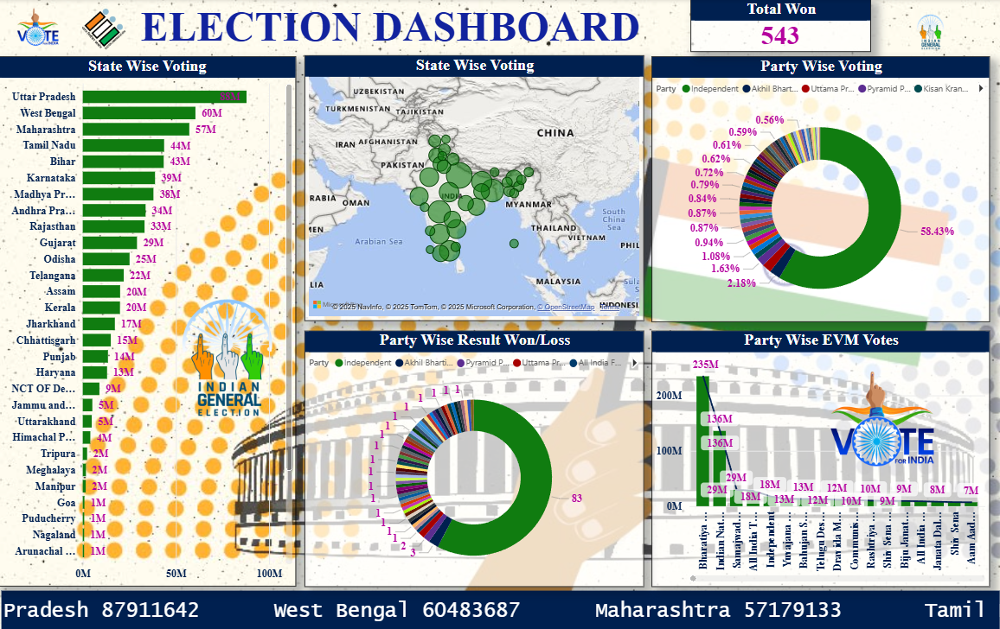

# 🗳️ Power BI India's Election Dashboard

This project is an interactive *Election Analysis Dashboard* built using *Power BI*, aimed at visualizing India's election data across different states, parties, and time periods. It provides a data-driven overview of voting trends, party performance, and election outcomes to support political analysis and public understanding.

---

## 🧠 Project Objective

To design an insightful Power BI dashboard that allows users to:

- Visualize election results across different Indian states and years
- Compare party-wise performance over multiple elections
- Analyze voter turnout, winning margins, and swing patterns
- Track the rise and fall of major political parties
- Enable interactive analysis for journalists, researchers, and the general public

---

## 🛠 Tools & Technologies Used

- *Power BI* – for designing the visual and interactive dashboard  
- *Microsoft Excel* – for preprocessing and cleaning raw election data  
- *DAX (Data Analysis Expressions)* – for computed KPIs and custom metrics  
- *Power Query Editor* – for merging, filtering, and transforming datasets  
- *Data Modeling* – to define relationships between parties, regions, years, and vote shares  
- *Time Intelligence Functions* – to analyze trends over different election years  
- *Slicers & Filters* – for dynamic selection by state, party, year, and constituency  
- *Bookmarks and Tooltips* – to provide a smooth and engaging user experience  
- *Choropleth Maps and Bar/Column Charts* – for geographical and comparative visualization  
- *Data Visualization Best Practices* – applied to enhance readability and storytelling  

---

## 📸 Dashboard Preview

